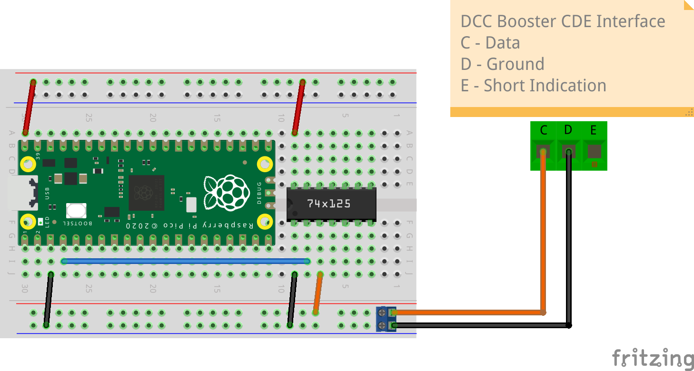

# pico-cs firmware

[](https://api.reuse.software/info/github.com/pico-cs/firmware)

pico-cs is a proof-of-concept for a model railway command station talking DCC (Digital Command Control) defined by the [NMRA DCC working group](https://www.nmra.org/dcc-working-group) and using the [Raspberry Pi Pico](https://www.raspberrypi.com/products/raspberry-pi-pico/) as DCC signal generator.

pico-cs is intended for skilled users with expert levels of model railway electronics and protocol knowledge.

## Why Raspberry Pi Pico / Pico W

- Its support of programmable IO (PIO) enables implementing the core DCC protocol within a few lines of assembler code
- Due to its dual cores the DCC signal generation and the command interface are implemented using different cores being run in parallel
- Its small form factor and cost effectiveness allows and supports multiple command stations to be used as part of the model railroad layout
- Its great ducumentation 
- The Pico W WiFi capabilities to operate the command station remotely via a TCP/IP connection
- And last but not least the fun using it

## Hardware

- Raspberry Pi Pico / Pico W
- A PC, Laptop, Raspberry Pi or any suitable device with an USB interface to flash the firmware and operate the command station via serial over USB and / or WiFi
- A model railway booster
- A model railroad locomotive roller test stand
- A DCC decoder equiped test locomotive

### Booster

As there is a lot of booster alternatives (motor shield, H-bridge, commercial booster, ...) the selection and connection options to the Pico goes beyond the scope of this document. You might find potential solutions searching the internet.

Voltage levels:
- Pico DCC signal output is on GP2 with 3.3V level
- As most digital booster DCC inputs would not work with 3.3V (please consult booster documentation) one need to choose a safe and reliable solution for level conversion
- Example with SN74HCT125N as level shifter ([Fritzing circuit diagram](https://fritzing.org))



### DCC decoder

Please be aware that not all DCC decoders do support all of the DCC commands. The pico-cs command station is using the DCC commands which most standard compliant DCC decoders should be able to understand. Nonetheless some decoders 
- do have issues with main track programming
- do behave wierd in case functions are used not supported by the decoder or writing CVs in general

**Please be cautious and test all loco decoders on a roller test stand before using on track.**

To mitigate some of the function setting issues the pico-cs command station is only refreshing functions which were explicitly used via the protocol.

## Quick Start

- Connect the Raspberry Pi Pico to your PC via an USB cable
- [Build](#build) the pico-cs firmware
- Install firmware (Pico: cs.uf2, Pico W: cs_w.uf2) via BOOTSEL mode (see [Raspberry Pi Pico documentation](https://www.raspberrypi.com/documentation/microcontrollers/raspberry-pi-pico.html))
- On macOS Ventura copying via drag&drop in Finder is broken - please copy via command line instead:
```
cp -X cs.uf2 /Volumes/RPI-RP2/
cp -X cs_w.uf2 /Volumes/RPI-RP2/
``` 
- Use a terminal emulation tool supporting serial over USB communication like the Serial Monotor of the [Arduino IDE](https://www.arduino.cc/en/software)
- Set the baud rate to 115200 and \<CR\> (Carriage Return) as command / message ending character
- The firmware uses the following Raspberry Pi Pico GPIOs:
  - GP2:  DCC signal output
  - GP3:  DCC signal output (inverted)
  - GP22: DCC signal enabled 

## Build

For building there is two options available:

- [local build](#local): install the toolchain and build on your local machine
- [docker build](https://github.com/pico-cs/docker-buld): no toolchain installation but a running docker environment on your local machine is required

### Local

To build the firmware the Raspberry Pi Pico C/C++ SDK and toolchain needs to be installed. For details please consult the [Raspberry Pi Pico documentation](https://www.raspberrypi.com/documentation/microcontrollers/raspberry-pi-pico.html).

As the binary for the Pico W including the WiFi and network capabilities is significant larger and the WiFi SSID and a WiFi password is needed two firmware versions are build:

```
git clone https://github.com/pico-cs/firmware.git
cd firmware/src
```

Pico:

```
mkdir pico_build
cd pico_build
cmake .. -DPICO_BOARD=pico
make
```
- firmware: cs.uf2 

Pico W:
```
export PICO_CS_WIFI_SSID="MyWifiName"
export PICO_CS_WIFI_PASSWORD="MyPassword"
export PICO_CS_TCP_PORT= 4242
mkdir pico_w_build
cd pico_w_build
cmake .. -DPICO_BOARD=pico_w
make
```
- if the TCP_PORT environment varible (PICO_CS_TCP_PORT) is not set the default port 4242 is used.
- firmware: cs_w.uf2 

## Inspect the firmware binaries

With the help of the [picotool](https://github.com/raspberrypi/picotool) the firmware binaries can be inspected:
```
./picotool info -a <path to firmware>/firmware/src/pico_build/cs.uf2 

File <path to firmware>/firmware/src/pico_build/cs.uf2:

Program Information
 name:          cs
 version:       v0.6.0
 web site:      https://github.com/pico-cs
 description:   pico-cs DCC command station
 features:      Refresh buffer size 128
                double reset -> BOOTSEL
                UART stdin / stdout
                USB stdin / stdout
 binary start:  0x10000000
 binary end:    0x1000e358

Fixed Pin Information
 0:   UART0 TX
 1:   UART0 RX
 2:   Main track: DCC signal output
 3:   Main track: DCC signal output (inverted)
 22:  Main track: DCC signal enabled
 25:  On-board LED

Build Information
 sdk version:       1.4.0
 pico_board:        pico
 boot2_name:        boot2_w25q080
 build date:        Dec 26 2022
 build attributes:  Release
```

```
./picotool info -a <path to firmware>/firmware/src/pico_w_build/cs_w.uf2

File ../../pico-cs/firmware/src/pico_w_build/cs_w.uf2:

Program Information
 name:          cs_w
 version:       v0.6.0
 web site:      https://github.com/pico-cs
 description:   pico-cs DCC command station
 features:      WiFi SSID MyWiFiSSID password MyWiFiPassword
                TCP port 4242
                Refresh buffer size 128
                double reset -> BOOTSEL
                UART stdin / stdout
                USB stdin / stdout
 binary start:  0x10000000
 binary end:    0x10055a18

Fixed Pin Information
 0:   CYW43 LED, UART0 TX
 1:   UART0 RX
 2:   Main track: DCC signal output
 3:   Main track: DCC signal output (inverted)
 22:  Main track: DCC signal enabled

Build Information
 sdk version:       1.4.0
 pico_board:        pico_w
 boot2_name:        boot2_w25q080
 build date:        Dec 26 2022
 build attributes:  Release
```

## Protocol

Please see [protocol](protocol.md) for information about the implemented text protocol.

## Features

- Pico firmware implementing DCC commands to control model railway locomotives
- Simple command human readable and debug friendly text protocol
  - which can be used directly via serial terminal programs supporting serial over USB
  - and easily integrated into any programming language or tool supporting serial over USB communication
- Pico W WiFi support
- [Go](https://go.dev/) [Client library](https://github.com/pico-cs/go-client)
- [MQTT gateway](https://github.com/pico-cs/mqtt-gateway)
  - combined with a MQTT message broker like [mosquitto](https://mosquitto.org) the command station can be easily controlled by other tools as for example [Node-RED](https://nodered.org)

## Licensing

Copyright 2021-2022 Stefan Miller and pico-cs contributers. Please see our [LICENSE](LICENSE.md) for copyright and license information. Detailed information including third-party components and their licensing/copyright information is available [via the REUSE tool](https://api.reuse.software/info/github.com/pico-cs/firmware).
